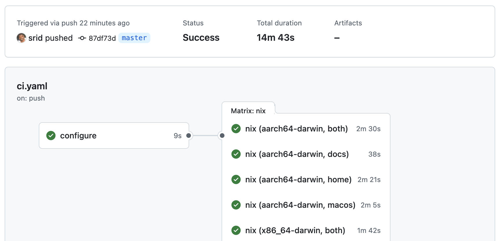

# `om ci`

`om ci` runs CI for your project. It builds all outputs in the flake, or optionally its [sub-flakes](https://github.com/hercules-ci/flake-parts/issues/119). You can run `om ci` locally or in an actual CI envirnoment, like GitHub Actions. Using [devour-flake] it will automatically build the following outputs:

| Type                   | Output Key                                      |
| ---------------------- | ----------------------------------------------- |
| Standard flake outputs | `packages`, `apps`, `checks`, `devShells`       |
| NixOS                  | `nixosConfigurations.*`                         |
| nix-darwin             | `darwinConfigurations.*`                        |
| home-manager           | `legacyPackages.${system}.homeConfigurations.*` |

The [stdout] of `om ci run` will be a list of store paths built.

[stdout]: https://en.wikipedia.org/wiki/Standard_streams#Standard_output_(stdout)

> [!TIP]
> If you are familiar with [nixci](https://github.com/srid/nixci), `om ci` is basically the successor to `nixci`.

## Basic Usage {#usage}

`om ci run` accepts any valid [flake URL](https://nixos.asia/en/flake-url) or a Github PR URL.

```sh
# Run CI on current directory flake
$ om ci # Or `om ci run` or `om ci run .`

# Run CI on a local flake (default is $PWD)
$ om ci run ~/code/myproject

# Run CI on a github repo
$ om ci run github:hercules-ci/hercules-ci-agent

# Run CI on a github PR
$ om ci run https://github.com/srid/emanote/pull/451

# Run CI only the selected sub-flake
$ git clone https://github.com/srid/haskell-flake && cd haskell-flake
$ om ci run .#default.dev

# Run CI remotely over SSH
$ om ci run --on ssh://myname@myserver ~/code/myproject
```

## Using in Github Actions {#gh}

In addition to serving the purpose of being a "local CI", `om ci` can be used in Github Actions to enable CI for your GitHub repositories.

### Standard Runners {#gh-simple}

Add this to your workflow file (`.github/workflows/ci.yml`) to build all flake outputs using GitHub provided runners:

```yaml
      - uses: actions/checkout@v4
      - uses: DeterminateSystems/nix-installer-action@main
      - name: Install omnix
        run: nix --accept-flake-config profile install "github:juspay/omnix"
      - run: om ci
```

### Self-hosted Runners with Job Matrix {#gh-matrix}

Here's a more advanced example that configures a job matrix. This is useful when you want to run the CI on multiple systems (e.g. `aarch64-linux`, `aarch64-darwin`), each captured as a separate job by GitHub, as shown in the screenshot below. It also, incidentally, demonstrates how to use self-hosted runners.



The `om ci gh-matrix` command outputs the matrix JSON for creating [a matrix of job variations](https://docs.github.com/en/actions/writing-workflows/choosing-what-your-workflow-does/running-variations-of-jobs-in-a-workflow). An example configuration, using self-hosted runners, is shown below.

> [!NOTE]
> This currently requires an explicit CI configuration in your flake, viz.: `om.ci.default.root.dir = ".";`.

```yaml
# Run on aarch64-linux and aarch64-darwin
jobs:
  configure:
    runs-on: x86_64-linux
    outputs:
      matrix: ${{ steps.set-matrix.outputs.matrix }}
    steps:
     - uses: actions/checkout@v4
     - id: set-matrix
       run: echo "matrix=$(om ci gh-matrix --systems=x86_64-linux,aarch64-darwin | jq -c .)" >> $GITHUB_OUTPUT
  nix:
    runs-on: ${{ matrix.system }}
    needs: configure
    strategy:
      matrix: ${{ fromJson(needs.configure.outputs.matrix) }}
      fail-fast: false
    steps:
      - uses: actions/checkout@v4
      - run: om ci run --systems "${{ matrix.system }}" ".#default.${{ matrix.subflake }}"
```

> [!TIP]
> If your builds fail due to GitHub's rate limiting, consider passing `--extra-access-tokens` (see [an example PR](https://github.com/srid/nixos-flake/pull/55)). If you get rate limits when accessing `github:nix-systems`, use [this workaround](https://github.com/srid/nixci/issues/83#issuecomment-2225903229).

## Configuring {#config}

By default, `om ci` will build the top-level flake, but you can tell it to build sub-flakes (here, `./dir1` and `./dir2`) by adding the following output to your top-level flake:

```nix
# myproject/flake.nix
{
  om.ci.default = {
    dir1 = {
      dir = "dir1";
    };
    dir2 = {
      dir = "dir2";
      overrideInputs.myproject = ./.;
    };
  }
}
```

You can have more than one CI configuration. For eg., `om ci run .#foo` will run the configuration from `om.ci.foo` flake output.

### Custom CI actions {#custom}

You can define custom CI actions in your flake, which will be run as part of `om ci run`. For example, to run tests in the nix develop shell:

```nix
{
  om.ci.default = {
    root = {
      dir = ".";
      steps = {
        # The build step is enabled by default. It builds all flake outputs.
        build.enable = true
        # Other steps include: lockfile & flake-check

        # Users can define custom steps to run any arbitrary flake app or devShell command.
        custom = {
          # Here, we run cargo tests in the nix shell
          # This equivalent to `nix develop .#default -c cargo test`
          cargo-test = {
            type = "devshell";
            # name = "default"
            command = "cargo test";
          };

          # We can also flake apps
          # This is equivalent to `nix run .#check-closure-size`
          closure-size = {
            type = "app";
            name = "check-closure-size";
          };
        };
      };
    };
  }
}
```

For a real-world example of custom steps, checkout [Omnix's configuration](https://github.com/juspay/omnix/blob/5322235ce4069e72fd5eb477353ee5d1f5100243/nix/modules/om.nix#L16-L33).

## Examples

Some real-world examples of how `om ci` is used with specific configurations:

> [!WARNING]
> These examples use the predecessor, `nixci`, so you want to replace `nixci` with `om ci` wherever applicable.

- [omnix](https://github.com/juspay/omnix/blob/5322235ce4069e72fd5eb477353ee5d1f5100243/nix/modules/om.nix#L16-L33)
- [services-flake](https://github.com/juspay/services-flake/blob/197fc1c4d07d09f4e01dd935450608c35393b102/flake.nix#L10-L24)
- [nixos-flake](https://github.com/srid/nixos-flake/blob/4af32875e7cc6df440c5f5cf93c67af41902768b/flake.nix#L29-L45)
- [haskell-flake](https://github.com/srid/haskell-flake/blob/d128c7329bfc73c3eeef90f6d215d0ccd7baf78c/flake.nix#L15-L67)
    - Here's [a blog post](https://twitter.com/sridca/status/1763528379188265314) that talks about how it is used in haskell-flake

## What it does {#mech}

- Check that the Nix version is not tool old (using [`om health`](health.md))
- Determine the list of flakes in the repo to build
  - By default, this is the root flake.
  - The user can also explicitly specify multiple sub-flakes in `om.ci.default` output of their root flake.
- For each (sub)flake identified, `om ci run` will run the following steps:
    - Check that `flake.lock` is up to date, if applicable.
    - Build all flake outputs, using [devour-flake](https://github.com/srid/devour-flake)[^schema]
      - Then, print the built store paths to stdout
    - Run `nix flake check`
    - Run user defined [custom steps](#custom)

[^schema]: Support for [flake-schemas](https://github.com/srid/devour-flake/pull/11) is planned

[devour-flake]: https://github.com/srid/devour-flake

## See also

- [github-nix-ci](https://github.com/juspay/github-nix-ci) - A simple NixOS & nix-darwin module for self-hosting GitHub runners
- [jenkins-nix-ci](https://github.com/juspay/jenkins-nix-ci) - Jenkins NixOS module that supports `nixci` (predecessor of `om ci`) as a Groovy function
- [cachix-push](https://github.com/juspay/cachix-push) - A flake-parts module that provides an app to enable whitelisted pushing and pinning of store paths to cachix.
